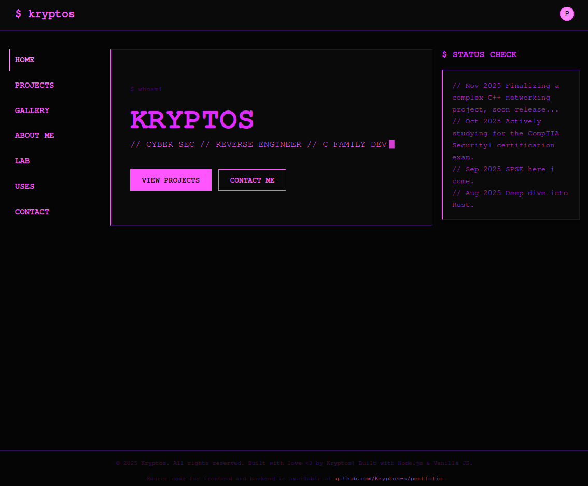

# kryptos-terminal-portfolio

> personal site. terminal vibes. mostly an excuse to mess with stuff.


**Live Demo:** https://lab.kryptosss.xyz




---

## About

skipped the usual "about me" page and built a terminal-style site instead.

frontend is plain static files. there's a small Express backend, but only because contact-form messages need somewhere to live.

nothing's exposed directly. traffic comes through a Cloudflare Tunnel, so the box never has an open public port.

---

## What's in here

- terminal-style UI, kinda like a shell prompt
- small Express API for the contact form and a couple of github proxy calls
- SQLite for storing messages
- server only listens on 127.0.0.1, all traffic comes through a Cloudflare Tunnel
- no frontend framework. plain JS, HTML, CSS.

---

## Stack

- frontend: vanilla JS, HTML, CSS
- backend: node + express
- db: SQLite
- security: helmet, rate limiting
- ingress: Cloudflare Tunnel (Zero Trust)

---

## Quick Start

### 1. Clone & Install

```bash
git clone https://github.com/Kryptos-s/portfolio.git
cd portfolio
npm install
```

---

### 2. Configuration

Create a `.env` file in the project root:

```env
PORT=3000
NODE_ENV=development
DATABASE_PATH=./server/portfolio.db
GITHUB_USERNAME=your_username
GITHUB_TOKEN=optional_token
```

notes:
- `GITHUB_TOKEN` is optional. only purpose is dodging github's rate limit on unauthenticated requests.
- nothing else needs setting up.

---

### 3. Run

```bash
npm run dev
# Server runs on http://127.0.0.1:3000
```

---

## Architecture

```
[ Browser ]
     ↓
[ Cloudflare Edge ]
     ↓
[ Cloudflare Tunnel ]
     ↓
[ localhost:3000 ]
     ↓
[ Express API ]
     ↓
[ SQLite DB ]
```

the backend never gets a public IP. all traffic goes through Cloudflare's edge.

---

## Docs

deeper notes (security model, deploy steps) live in the wiki:

https://github.com/Kryptos-s/portfolio/wiki

---

## License

MIT
